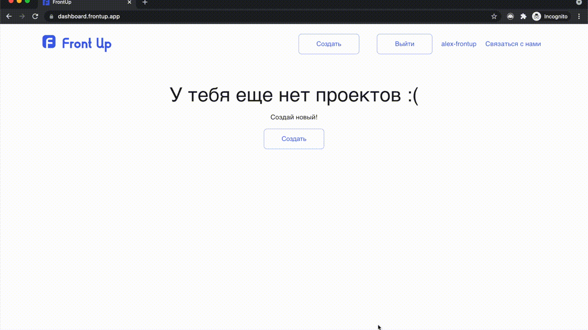
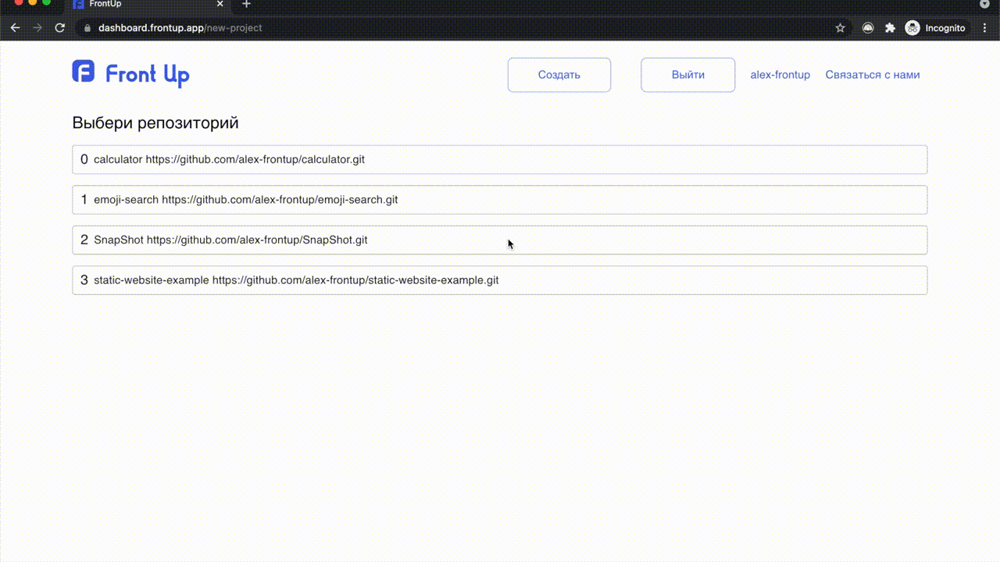
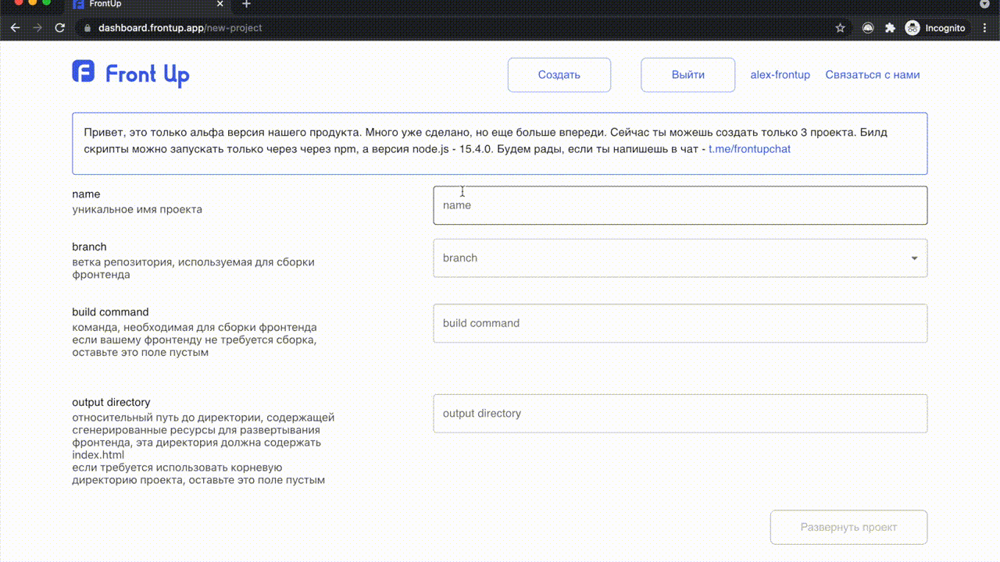
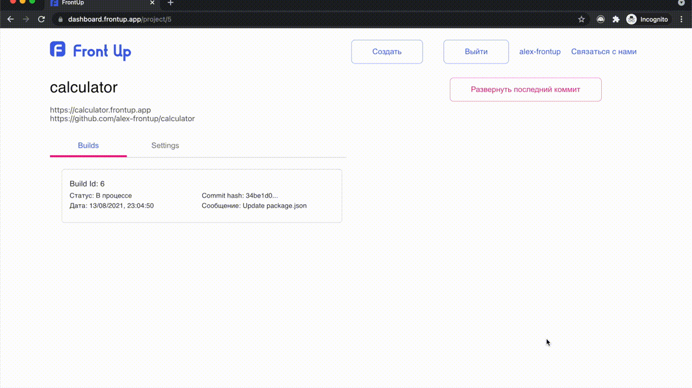
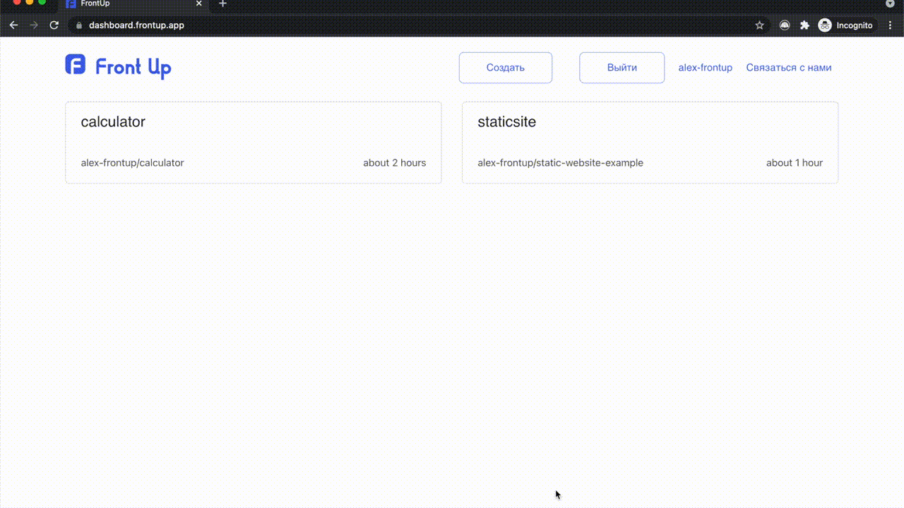

# Создание сайта со сборкой проекта!

### Для создания нового проекта нажмите кнопку "создать"

### выберете репозиторий с кодом вашего фронтенда

### заполните поля

### Откроется страница с созданным  проектом и списком билдов

### Для удаления проекта перейдите на страницу проекта в раздел "Settings" и нажмите на кнопку "Удалить проект"

