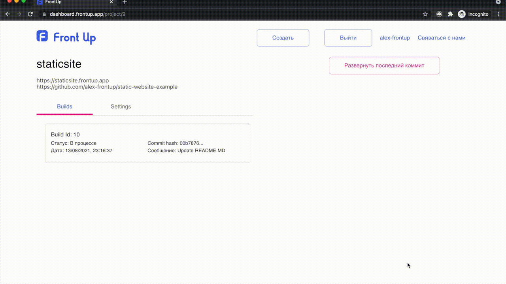

# Создание сайта без сборки

### Для создания нового проекта нажмите кнопку "Создать"

### Выберите репозиторий с кодом вашего фронтенда

### Заполните необходимые поля
- **branch** - ветка репозитория вашего проекта, которая будет использоваться для сборки проекта
- **name** - уникальное имя вашего проекта, также это имя будет использовано в качестве сабдомена, если такой сабдомен уже существует, то будет добавлен уникальный идентификатор
- **build** command - команда, необходимая для сборки фронтендаесли вашему фронтенду не требуется сборка, оставьте это поле пустым
- **output directory** - относительный путь до директории, содержащей сгенерированные ресурсы для развертывания фронтендa, эта директория должна содержать index.html
   если требуется использовать корневую директорию проекта, оставьте это поле пустым

#### Нажмите кнопку "Развернуть проект", чтобы начать процесс

### Откроется страница с созданным проектом и списком билдов
- Нажмите на запущенный билд, чтобы увидеть статус билда и логи
- В случае успешного завершения билда, статус изменится на "Успешно завершен" и можно перейти на страницу с готовым проектом

#### Готово! Ваш сайт равзернут с помощью frontup

### Для удаления проекта перейдите на страницу проекта в раздел "Settings" и нажмите на кнопку "Удалить проект"

### Дополнительные материалы
 - [calculator.frontup.app](https://calculator.frontup.app) пример развернутого проекта
 - [github.com/artyomfrontup/calculator2](https://github.com/artyomfrontup/calculator2) исходный код проекта на гитхаб 
 